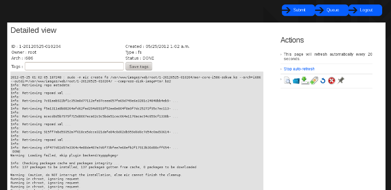

Usage
*****

Summary
-------

Once a participant has been installed and configured it should be started and
registered. To see the installed participants do ::

   skynet list

Worker ::

   skynet enable build_image
   skynet enable build_ks
   skynet register build_image
   skynet register build_ks

Web UI ::

   service lighttpd start
   skynet enable img-web
   skynet enable request_image
   skynet enable update_image_status
   skynet register request_image
   skynet register update_image_status

You should now be able to access the web interface and admin at ::

   http://$IP-address/img/
   http://$IP-address/img/admin/

Web interface
-------------

The landing page at http://$IP-address/img/ is pretty simple and should look like this :

To start using the application you will need to login first if you still haven't. Either as
the admin user you created during installation, a user you created in the admin interface,
or an LDAP user if you have setup LDAP.

Next the submit job page looks like this :

After submitting a kickstart to be built you will be redirected to the queue page :

The image details page looks like this :

